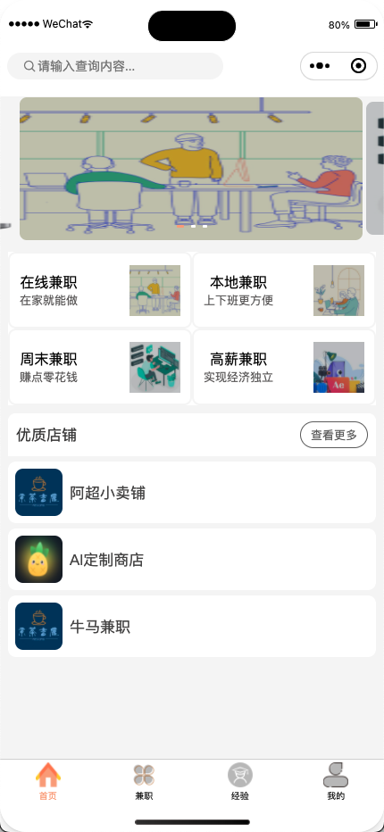

# 兼职小程序平台

一个使用原生小程序语法开发的兼职小程序平台～

小程序中未使用任何的组件库，完全由作者手撸，实现从零到亿！！

其中的特色包含自定义的小程序顶部菜单栏、自定义了搜索框和页面、自定义轮播图、自定义下拉动画、封装了微信请求和文件上传的接口等众多的功能。

后端代码遵循开发规范，代码清晰易读，其中还包含了代码生成器、全局异常等功能，可以实现快速的代码复用。

兼职小程序平台为用户和商家提供了平台，商家通过小程序的商家认证后成为平台的入驻者，可以在平台上进行兼职的发布；用户可以报名符合自身条件的兼职，同时还可以在平台上发布自己的一些经验来获得人气。在兼职结束后，用户和商家可以进行互相的评价，为彼此进行打分，从而提高兼职的质量和维护平台的风气。

兼职小程序平台由小程序端和管理端构成

功能大纲图如下所示

### 小程序端

#### 微信登录

小程序启动时将会展示开屏广告（默认时间为 5 秒钟，可跳过），后直接到登录页面，选择快速登录或者暂时不登录。快速登录将会调取微信授权登录的接口；暂时不登录小程序的功能部分不可用。

#### 首页

小程序首页使用了自定义搜索框作为小程序的头部，使用了自定义轮播图，同时呈现了不同的兼职种类，展示了系统中的优质店铺。

搜索框组件

兼职种类

优质店铺

#### 兼职

用户在我的页面成功入驻小程序成为商家后，兼职页面顶部将会展现店铺名和发布兼职的入口，商家可以进行兼职的发布。用户可以在兼职页面进行兼职的浏览和报名等操作。

#### 经验

用户和商家都可以在经验页面进行经验的浏览、点赞、收藏、评论以及经验的发布，同时在经验详情页面可以对发布经验的用户进行关注和取关操作。

#### 我的

我的页面展示用户的个人信息，商家认证的入口，我的收藏个人的信息。

### 管理端

#### 轮播图

包含了轮播图的新增，删除，修改等操作

#### 兼职管理

兼职管理分为兼职信息和兼职种类。兼职信息展示用户发布的兼职信息，包含了对兼职的增删查改以及对商家和用户互评的信息查看，兼职信息页面将分页展示兼职信息，兼职报名信详情中可以查看评价的分数等级和下载材料，对当前的评价内容进行审核；兼职种类为管理员对小程序端端兼职种类的操作，包含基础的增删查改功能。

#### 商家管理

商家管理分页商家信息和资质审核。商家信息分页展示已经通过审核的小程序商家，可以进行小程序商家搜索和删除等操作；资质审核主要是对小程序端用户的商家认证信息进行审核，管理员可以在该页面对商家提交的入驻申请材料进行查看，对认证材料进行下载，从而判断当前商家提交的资料是否符合规范，进一步的确定是否为当前用户通过商家认证，通过的商家认证将会展示到系统的商家信息菜单栏中，未通过的商家认证审核将会出现在该页面的已审核菜单栏下，并且使用 未通过 标签来进行标注。

#### 经验管理

经验管理页面为用户分页呈现了小程序端的用户发布的经验信息，提供关键词搜索功能和删除功能。当用户点击经验标题时，将会通过弹窗的形式展示当前经验的所有评论内容，管理员可以在弹窗上对当前的用户评论给进行删除操作。

#### 用户管理

用户管理页面将分页呈现当前小程序已经授权登录的用户，提供关键词搜索的功能。管理员仅能在当前页面对用户的信息进行查看和搜索，系统不提供修改、删除以及更新当前小程序用户信息的功能。

### 结尾

更多信息在 **微信公众号 【京茶吉鹿】**中获取

如果项目对你有帮助，希望能收到你的 ✨star～

